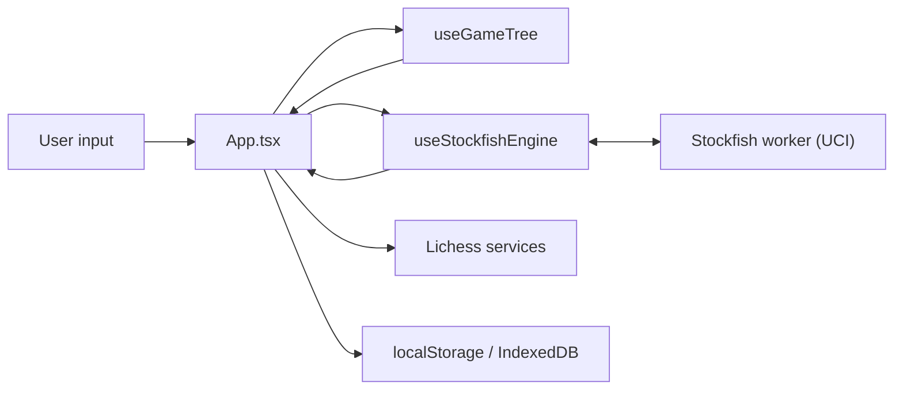

# Architecture

Web Chess is a single-page React app with the engine in a Web Worker. Game
state, analysis results and every setting live on the main thread; Stockfish
runs in a worker so the board stays responsive while it searches.

Structured to mirror [web-katrain's `docs/architecture.md`][katrain], so the
three sibling apps can be read against each other. The third is
[web-xiangqi][xiangqi]; how the three compare, and what is worth moving
between them, is tracked in [the cross-app learning plan](cross-app-learning-plan.md)
alongside this file.

[katrain]: https://github.com/Sir-Teo/web-katrain/blob/main/docs/architecture.md
[xiangqi]: https://github.com/Sir-Teo/web-xiangqi/blob/main/docs/architecture.md

## Runtime Overview

## Main Thread

`src/App.tsx` is the whole application shell, and at ~5,300 lines it is by far
the largest file in the repo. It owns the board, the panels, every dialog, and
all persisted settings. This is the one place the three apps diverge sharply:
web-katrain moved the equivalent state into `store/gameStore.ts` and has
component-level tests as a result. Breaking `App.tsx` into a store is the
largest outstanding item in `docs/cross-app-learning-plan.md`.

What is already factored out and worth reaching for before adding to `App.tsx`:

- `src/engine/` — pure logic: UCI parsing, analysis math, PGN, FEN, the
  saved-games model, opening and tablebase clients. Nearly every module here
  has a colocated `*.test.ts`; **this is where new logic belongs.**
- `src/hooks/` — stateful glue: the engine, the game tree, the AI player,
  cloud evaluation, the library.
- `src/components/` — dialogs and panels. The three dialogs share
  `NewGameDialog.css` and `useModalFocus`.

## Game Tree

`useGameTree` owns the move tree and is the only thing that mutates it. It
returns a memoized handle, so `gameTree` keeps its identity between renders
and changes only when the tree does — which several effects depend on.

Nodes carry the move, the FEN after it, a comment and a review quality label.
Variations are real: `mainLine()` and `currentPath()` are different walks, and
PGN export can include either.

## Engine Boundary

`useStockfishEngine` is a full UCI client, not a thin wrapper:

- Commands go through a queue with per-command completion detection, so
  `isready`/`uci`/`go` are never interleaved wrongly.
- `info` lines are parsed by `parseInfoLine` and flushed to React on a 100 ms
  interval rather than per line, because the engine emits far faster than the
  UI can usefully render.
- Engine builds are declared in `engine/profiles.ts` with the capabilities each
  needs. `lite-single-local` is the default because it needs no special
  headers; the multi-threaded builds need cross-origin isolation, which
  `index.html` obtains on GitHub Pages via `coi-serviceworker`.
- Thread count and starting hash size are sized to the device by
  `recommendedThreadCount` and `recommendedHashMb`.

Both sizing functions compare memory well below 8, because **browsers disagree
about the top of `navigator.deviceMemory`'s range**. The spec describes
clamping the value to limit fingerprinting, and Chromium 148 was observed here
reporting `32`. A threshold at 8 therefore sorts identical hardware differently
depending on the browser — the same desktop got four threads in one and eight
in another. Below 4 is a constraint under either behaviour; 8GB is not.

## Evaluations

Evaluations are keyed by FEN in a single `Map` on `App.tsx`.
`mergeEvaluationSnapshot` decides whether a new snapshot replaces a stored one
— deeper, more nodes, and a live search beats a cloud probe of equal depth.

The map gets a **new identity on every accepted engine update**, which is
several times a second during a search. Anything that reacts to evaluations
must expect that; a debounced effect that lists it as a dependency will never
fire while the engine runs. The auto-save learned this the hard way and now
reads evaluations from a ref.

## Review and Accuracy

`engine/analysis.ts` turns the evaluation map into review rows. Scoring is on
**winning chances, not centipawns**, using Lichess's published curves:

- `winPercentFromCp` — the win-percentage model, also used by the trend graph.
- `accuracyFromWinPercentLoss` — accuracy from percentage points given up.
- Quality labels take the milder of the raw centipawn reading and the
  practical one, with the win-percent ladder *derived* from the centipawn
  ladder so the two agree at equality and only diverge once a game is decided.

## Storage

| What | Where | Module |
| --- | --- | --- |
| Saved games | IndexedDB `web-chess-library`, falling back to localStorage then memory | `engine/gameLibraryStorage.ts` |
| Game in progress | localStorage, one slot | `engine/autoSave.ts` |
| Analysis settings | localStorage | `storageKeys.ts` |
| Cloud eval / tablebase / opening caches | localStorage, bounded | `engine/storageCache.ts` |

Everything read back from storage goes through a normalizer that drops
anything malformed, so a corrupted store degrades to empty rather than
reaching the UI.

## External Services

Lichess cloud evaluation, the opening explorer and the tablebase all go
through `engine/lichessQueue.ts`: one request at a time, with a shared backoff
after a 429. Tokens are session-only and never persisted.

## Data Formats

- PGN import/export: `engine/pgn.ts`. Import builds the whole variation tree
  and recovers `[%eval ...]` annotations.
- FEN parsing, validation and the position editor: `engine/fen.ts`,
  `engine/positionSetup.ts`.
- Share links: `engine/shareLink.ts` (FEN in the URL hash).

## Board measurement in a zero-sized viewport

`react-chessboard` measures its own container and throws `Square width not
found` from `<Piece2>` when that container has no width. `AppErrorBoundary`
catches it; enough repeats and the app falls back to its error screen.

The only trigger found is a viewport of literally `0 × 0` — a hidden or
collapsed browser window, which is what an automation pane looks like when it
is not on screen. Every real size behaves: 800×500, 800×700 and 1400×900 all
load a historical game without complaint, in dev and in a production build.

Recorded because it is easy to misdiagnose, and was: it first looked like a
dev-only timing issue sensitive to `App.tsx`'s import graph, then like a
regression from a specific commit, because the pane happened to be hidden for
some runs and not others. It is neither. If you see it, check `innerWidth`
before bisecting anything.

Worth a guard only if the app should survive being rendered in a hidden tab or
a `display: none` iframe — hold `<Chessboard>` back until its container reports
a non-zero width, for which `useElementWidth` already exists.

## A mate turns the centipawn loss into nonsense

Found by reading a finished review rather than a test. On the Opera Game the
panel showed **ACPL 316** beside **Mistake 0, Blunder 0**, which cannot both be
true, and one row read:

    15... Nxd7   Lost 93.61   Inaccuracy

A 93.61-pawn loss labelled an inaccuracy. The mechanism:

- `scoreToCp` maps any mate to ±10000, whatever its distance.
- Black stands at roughly -500 and plays into a forced mate. `before` is -500
  from Black's point of view; `after` is +10000 from White's. The delta is
  therefore about -9500, i.e. "lost 95 pawns".
- `summarizeAccuracy` averages that raw figure, so one such move adds ~284 to a
  33-move ACPL. That is nearly all of the 316.
- The *label* is right, because labels moved to win-percent loss: someone
  already lost gives up little by being mated. So the label and the number next
  to it disagree, and the number is the wrong one.

This predates the win-percent work but was hidden by it: when labels were also
centipawn-based the two at least agreed with each other, wrongly. Only the
scoring changed; nobody looked at ACPL in a game that ends in mate.

The fix is the one Lichess uses — cap the evaluation (they use ±1000cp) before
taking a centipawn loss, so a forced mate contributes a large-but-sane figure
instead of swamping the average. Not done here: it changes a number users have
already seen, and it wants its own before/after on real games rather than a
rushed edit. `accuracyFromCentipawnLoss` is unaffected either way — it is only
the legacy fallback now, and it saturates near zero long before 9500.

## The winrate line draws across gaps it does not have data for

`buildWinrateSeries` skips a ply whose position has no evaluation
(`if (!isFiniteNumber(cp)) continue`), and the trend graph then joins the
remaining points with one continuous path, positioning each by its real `index`.
A skipped ply is therefore drawn as a straight segment spanning it — a line
where there is no evaluation.

The full picture only shows this after a completed review, where every position
is evaluated and there are no gaps. It is visible during a partial analysis,
which is exactly when someone is watching the graph fill in.

Not changed, for two reasons: interpolating a trend line across a missing sample
is a defensible reading rather than plainly wrong, and the `area` fill is built
by closing the same path string, so breaking the stroke into subpaths needs the
fill reworked with it and a look at the result. web-katrain's `buildPath` is the
pattern if it is ever done — it sets `started = false` on a gap so the stroke
stops and restarts, and it filters non-finite values before taking min/max for
the axis, since one bad value there poisons the whole scale rather than one
point. This repo is safe from the scale half already, because the skip happens
at the source and the series only ever holds finite numbers.

## Project Invariants

- Engine scores are POV side-to-move; after a move the perspective flips.
  `deltaCp` in a review row is `-after - before` for that reason.
- Anything user-facing derived from an evaluation should be win-percent based,
  not centipawn based, so it reads correctly in a decided position.
- New pure logic goes in `src/engine/` with a colocated test, not into
  `App.tsx`.
- Storage readers must never throw on bad data; return empty and move on.
- A capability value read from a browser API needs its documented range
  checked before a threshold is chosen against it.
