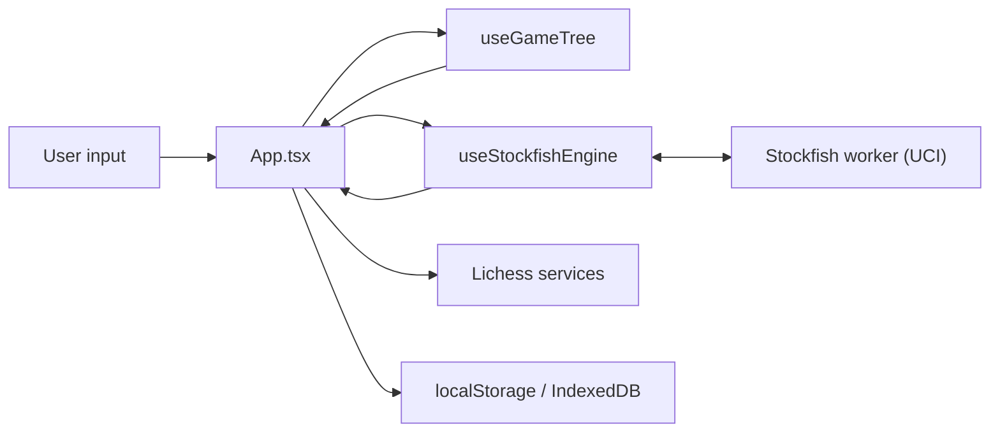

# Architecture

Web Chess is a single-page React app with the engine in a Web Worker. Game
state, analysis results and every setting live on the main thread; Stockfish
runs in a worker so the board stays responsive while it searches.

Structured to mirror [web-katrain's `docs/architecture.md`][katrain], so the
three sibling apps can be read against each other. The third is
[web-xiangqi][xiangqi]; how the three compare, and what is worth moving
between them, is tracked in [the cross-app learning plan](cross-app-learning-plan.md)
alongside this file.

[katrain]: https://github.com/Sir-Teo/web-katrain/blob/main/docs/architecture.md
[xiangqi]: https://github.com/Sir-Teo/web-xiangqi/blob/main/docs/architecture.md

## Runtime Overview

## Main Thread

`src/App.tsx` is the whole application shell, and at ~5,300 lines it is by far
the largest file in the repo. It owns the board, the panels, every dialog, and
all persisted settings. This is the one place the three apps diverge sharply:
web-katrain moved the equivalent state into `store/gameStore.ts` and has
component-level tests as a result. Breaking `App.tsx` into a store is the
largest outstanding item in `docs/cross-app-learning-plan.md`.

What is already factored out and worth reaching for before adding to `App.tsx`:

- `src/engine/` — pure logic: UCI parsing, analysis math, PGN, FEN, the
  saved-games model, opening and tablebase clients. Nearly every module here
  has a colocated `*.test.ts`; **this is where new logic belongs.**
- `src/hooks/` — stateful glue: the engine, the game tree, the AI player,
  cloud evaluation, the library.
- `src/components/` — dialogs and panels. The three dialogs share
  `NewGameDialog.css` and `useModalFocus`.

## Game Tree

`useGameTree` owns the move tree and is the only thing that mutates it. It
returns a memoized handle, so `gameTree` keeps its identity between renders
and changes only when the tree does — which several effects depend on.

Nodes carry the move, the FEN after it, a comment and a review quality label.
Variations are real: `mainLine()` and `currentPath()` are different walks, and
PGN export can include either.

## Engine Boundary

`useStockfishEngine` is a full UCI client, not a thin wrapper:

- Commands go through a queue with per-command completion detection, so
  `isready`/`uci`/`go` are never interleaved wrongly.
- `info` lines are parsed by `parseInfoLine` and flushed to React on a 100 ms
  interval rather than per line, because the engine emits far faster than the
  UI can usefully render.
- Engine builds are declared in `engine/profiles.ts` with the capabilities each
  needs. `lite-single-local` is the default because it needs no special
  headers; the multi-threaded builds need cross-origin isolation, which
  `index.html` obtains on GitHub Pages via `coi-serviceworker`.
- Thread count and starting hash size are sized to the device by
  `recommendedThreadCount` and `recommendedHashMb`.

Both sizing functions compare memory well below 8, because **browsers disagree
about the top of `navigator.deviceMemory`'s range**. The spec describes
clamping the value to limit fingerprinting, and Chromium 148 was observed here
reporting `32`. A threshold at 8 therefore sorts identical hardware differently
depending on the browser — the same desktop got four threads in one and eight
in another. Below 4 is a constraint under either behaviour; 8GB is not.

## Evaluations

Evaluations are keyed by FEN in a single `Map` on `App.tsx`.
`mergeEvaluationSnapshot` decides whether a new snapshot replaces a stored one
— deeper, more nodes, and a live search beats a cloud probe of equal depth.

The map gets a **new identity on every accepted engine update**, which is
several times a second during a search — `shouldReplaceEvaluationSnapshot`
takes a reading with more nodes at the same depth as an improvement, so every
100ms flush produces a new Map. Measured in `analysis.test.ts`: 100 identity
changes across 100 flushes of a live search.

Anything that reacts to evaluations must expect that. A debounced effect that
lists it as a dependency will never fire while the engine runs — the auto-save
did, and a game review could grind through a hundred positions with nothing
written. It keeps the dependency, deliberately, so a recovered game carries the
analysis it had; what changed is that `autoSaveDelayMs` adds a five-second
deadline to the 700ms debounce, so the wait shrinks as the deadline approaches
and reaches zero at it.

There is a second cost to the churn, and it is the reason `analysis.ts` caches
its replay: every consumer of the map recomputes at that rate. `buildReviewRows`,
`buildWinrateSeries` and `buildWdlSeries` each walked the whole game from the
root, 14.72 ms together on a 120-ply game, ten times a second. They now share
one content-keyed replay — 0.09 ms warm, 1.11 ms cold — because none of the
replay depends on an evaluation.

## Review and Accuracy

`engine/analysis.ts` turns the evaluation map into review rows. Scoring is on
**winning chances, not centipawns**, using Lichess's published curves:

- `winPercentFromCp` — the win-percentage model, also used by the trend graph.
- `accuracyFromWinPercentLoss` — accuracy from percentage points given up.
- Quality labels take the milder of the raw centipawn reading and the
  practical one, with the win-percent ladder *derived* from the centipawn
  ladder so the two agree at equality and only diverge once a game is decided.
  That derivation is what makes "take the milder" safe rather than a silent
  re-grading; `qualityAgreement.test.ts` pins it.

Every row also carries the phase it was played in:

- `gamePhase.ts` reads the phase from **material**, not the move number.
  web-katrain splits by move number, which suits Go; here a queen trade on move
  8 and a 90-move rook ending are both "the middle" by move count.
- The phase is taken from the position *before* the move, so the move that
  trades the last queen is filed in the middlegame it was played in rather than
  the endgame it created.
- The ply is counted from the start of the **game**, not the review, so
  analysing from a mid-game FEN does not restart the phase clock and call move
  20 an opening.
- `summarizeAccuracyByPhase` splits accuracy by phase and omits a phase with
  nothing scored; `filterReviewRowsByPhase` narrows the whole review to one.
  Nothing about the phase is persisted — it is recomputed from the position.

## Storage

| What | Where | Module |
| --- | --- | --- |
| Saved games | IndexedDB `web-chess-library`, falling back to localStorage then memory | `engine/gameLibraryStorage.ts` |
| Game in progress | localStorage, one slot | `engine/autoSave.ts` |
| Analysis settings | localStorage | `storageKeys.ts` |
| Cloud eval / tablebase / opening caches | localStorage, bounded | `engine/storageCache.ts` |

Everything read back from storage goes through a normalizer that drops
anything malformed, so a corrupted store degrades to empty rather than
reaching the UI.

`engine/storage.ts` is the boundary where storage is allowed to *fail* —
distinct from the normalizers, which handle data that is present but wrong.
`readStorage`/`writeStorage`/`removeStorage` return `null`/`false` instead of
throwing, so private mode, a blocked-cookie setting and a quota error stop being
things each reader has to remember. Ported from web-katrain, which guards once
at the boundary rather than once per reader.

`autoSave.ts` uses it. The others still carry their own `try`/`catch`, which
works — the wrapper is for anything new, and for whichever of them is next
touched. Worth knowing why it exists at all: `autoSave` had a private
`getDefaultStorage` that was a duplicate of `getLocalStorage` down to the
`globalThis` fallback, and web-xiangqi's `autoSave` had independently grown the
same eight lines. A missing abstraction had manufactured the duplication twice
over.

## External Services

Lichess cloud evaluation, the opening explorer and the tablebase all go
through `engine/lichessQueue.ts`: one request at a time, with a shared backoff
after a 429. Tokens are session-only and never persisted.

## Data Formats

- PGN import/export: `engine/pgn.ts`. Import builds the whole variation tree
  and recovers the machine annotations.

  A PGN is this app's save format, so what it can carry decides what a saved
  game keeps. Three things were being lost, all for one reason — they were
  written for a human to read rather than for the app to read back:

  | | was | is |
  | --- | --- | --- |
  | Per-move evaluation | `[%eval 0.31]`, recovered | unchanged |
  | Root evaluation | never written; first move ungradable on reload | written in the comment ahead of the first move |
  | Best move | prose `Best Nf3`, unreadable | also `[%wcbest e2e4]`, beside the eval it belongs to |
  | Quality label | prose `Blunder`, re-appended every round trip | derived from the evaluations, not stored |

  The rule the three arrived at is in the invariants: a machine annotation gets
  a `[%name ...]` command, because the standard reserves that shape and nothing
  else in a comment is distinguishable from something the reader typed. Import
  strips every such command from the human comment now, not only `[%eval]` —
  a Lichess export's `[%clk 0:03:00]` was being shown as a comment.

  Note what is *not* stored: the quality labels. They are recomputed from the
  evaluations on load, which is why removing them from the comment lost
  nothing. Verified by saving a reviewed game and loading it back: every row
  returns with its grade and its best move.
- FEN parsing, validation and the position editor: `engine/fen.ts`,
  `engine/positionSetup.ts`.
- Share links: `engine/shareLink.ts` (FEN in the URL hash).

## Board measurement in a zero-sized viewport

`react-chessboard` measures its own container and throws `Square width not
found` from `<Piece2>` when that container has no width. `AppErrorBoundary`
catches it; enough repeats and the app falls back to its error screen.

The only trigger found is a viewport of literally `0 × 0` — a hidden or
collapsed browser window, which is what an automation pane looks like when it
is not on screen. Every real size behaves: 800×500, 800×700 and 1400×900 all
load a historical game without complaint, in dev and in a production build.

Recorded because it is easy to misdiagnose, and was: it first looked like a
dev-only timing issue sensitive to `App.tsx`'s import graph, then like a
regression from a specific commit, because the pane happened to be hidden for
some runs and not others. It is neither. If you see it, check `innerWidth`
before bisecting anything.

**Guarded.** `<Chessboard>` is held back while the computed board width is
zero. The guard is on the width the board is *given* rather than on a measured
container: only the mobile branch of the sizing maths can reach zero, because
it is `max(0, viewport - chrome)` and goes to zero as soon as the chrome is
wider than the window, while the desktop branch floors at 260px.

Measured at `innerWidth` 80, the narrowest this repo's preview allows: before
the guard, 64 squares and `Square width not found` thrown repeatedly; after,
no board, no throw, and the rest of the app intact. At 1440x900 the board
still renders 64 squares at 667px.

Written after hitting it for real while resizing the preview, which is what
turned the note above from a curiosity into a guard.

## A mate turns the centipawn loss into nonsense

Found by reading a finished review rather than a test. On the Opera Game the
panel showed **ACPL 316** beside **Mistake 0, Blunder 0**, which cannot both be
true, and one row read:

    15... Nxd7   Lost 93.61   Inaccuracy

A 93.61-pawn loss labelled an inaccuracy. The mechanism:

- `scoreToCp` maps any mate to ±10000, whatever its distance.
- Black stands at roughly -500 and plays into a forced mate. `before` is -500
  from Black's point of view; `after` is +10000 from White's. The delta is
  therefore about -9500, i.e. "lost 95 pawns".
- `summarizeAccuracy` averages that raw figure, so one such move adds ~284 to a
  33-move ACPL. That is nearly all of the 316.
- The *label* is right, because labels moved to win-percent loss: someone
  already lost gives up little by being mated. So the label and the number next
  to it disagree, and the number is the wrong one.

This predates the win-percent work but was hidden by it: when labels were also
centipawn-based the two at least agreed with each other, wrongly. Only the
scoring changed; nobody looked at ACPL in a game that ends in mate.

**Fixed.** `reportedCentipawnLoss` bounds what gets reported at 1000cp, the
figure Lichess uses. The raw `deltaCp` is left raw — move quality reads winning
chances and is unaffected, and anything that legitimately wants the real number
still has it. Measured on the same review of the Opera Game: ACPL 316 -> 62, and
the row above from "Lost 93.61" to "Lost 10.00+". Accuracy and every quality
count were unchanged, which is the point — only the centipawn half was wrong.

The trailing "+" is deliberate: it says the real figure is off this scale, which
is what a forced mate is, rather than presenting a bound as though it had been
measured.

## A third pair, latent: two accuracy curves

Found by applying the rule the two real defects suggested — look for one
judgement expressed two ways — rather than by hitting it.

`accuracyForRow` prefers `accuracyFromWinPercentLoss` (Lichess's curve over
winning chances) and falls back to `accuracyFromCentipawnLoss`
(`100 * exp(-loss/300)`) for a row with no win-percent reading. Those are two
answers to "how accurate was this move", and neither is derived from the other.
They disagree, measured at equality:

| centipawn loss | via winning chances | via centipawns | gap |
| --- | --- | --- | --- |
| 20 | 92.1 | 93.6 | -1.5 |
| 100 | 66.2 | 71.7 | -5.4 |
| 200 | 44.7 | 51.3 | **-6.6** |
| 800 | 11.4 | 6.9 | +4.4 |

**Unreachable, and now pinned as such** by `accuracyCurveReach.test.ts` — the
claim was read off the code, so it is enforced rather than trusted. Deliberately
kept: `buildReviewRows` sets
`winPercentLoss` on every row it also gives a finite `deltaCp`, and
`summarizeAccuracy` skips anything pending, so the fallback has no live caller.
It exists for rows built before the win-percent work and is pinned by a test.

The hazard is not today's behaviour, it is the shape: `winPercentLoss` is
optional on `ReviewRow`, so any future producer that omits it puts rows scored
on *different curves* into the same average, differing by up to 6.6 points, with
nothing to signal it. If the legacy path is ever confirmed dead, deleting it
removes the second representation entirely, which is the fix this codebase keeps
arriving at.

## The winrate line draws across gaps it does not have data for

`buildWinrateSeries` skips a ply whose position has no evaluation
(`if (!isFiniteNumber(cp)) continue`), and the trend graph then joins the
remaining points with one continuous path, positioning each by its real `index`.
A skipped ply is therefore drawn as a straight segment spanning it — a line
where there is no evaluation.

The full picture only shows this after a completed review, where every position
is evaluated and there are no gaps. It is visible during a partial analysis,
which is exactly when someone is watching the graph fill in.

Not changed, for two reasons: interpolating a trend line across a missing sample
is a defensible reading rather than plainly wrong, and the `area` fill is built
by closing the same path string, so breaking the stroke into subpaths needs the
fill reworked with it and a look at the result. web-katrain's `buildPath` is the
pattern if it is ever done — it sets `started = false` on a gap so the stroke
stops and restarts, and it filters non-finite values before taking min/max for
the axis, since one bad value there poisons the whole scale rather than one
point. This repo is safe from the scale half already, because the skip happens
at the source and the series only ever holds finite numbers.

## What `npm run verify` covers

`npm run verify` runs typecheck, lint, the test suite and the build — every gate
CI runs except `npm audit`, which is left out so the command works offline. For
this repo that is the whole of CI, so a green verify means the deploy should go
through.

Two things worth knowing about the pieces:

- `tsc -b` here *does* include the test files, unlike web-katrain where `test/`
  sits outside the built projects and needs a separate `test:typecheck`.
  Confirmed by putting a type error in a test file: verify exits 2.
- `npm test` alone does not typecheck anything. Vitest transpiles without
  checking, so a test can pass while failing to compile — which is how a broken
  fixture was committed tonight.

Run `verify` rather than the parts. Chaining them by hand is how the same
mistake gets made twice: `npm run typecheck | tail -2 && npm run lint` reports
tail's exit code, not the compiler's.

## A derived default becomes a stored preference on first run

`defaultHashMb()` sizes the engine hash from `detectEngineCapabilities()`, and
settings load takes the stored value if there is one:

    hashMb: normalizeInteger(parsed.hashMb, 16, 512, defaultHashMb())

But `persistSettings` runs from an effect on mount and writes the whole settings
object. So on a first visit the derived value is computed, immediately written to
localStorage, and read back on every later visit. It stops being a default and
becomes a stored preference the user never set.

The consequence: improving `recommendedHashMb` reaches only browsers that have
never opened the app. Anyone already using it keeps whatever their first visit
concluded — which for most existing users is the flat 64 that predates the
capability-aware sizing.

A setting the user *chose* should of course persist. The problem is that a
derived default is indistinguishable from a choice once it is in the same
object, so there is no way to re-derive it without also discarding real
preferences. The fix would be to store only what was explicitly set and derive
the rest on load, which is the same "keep the evidence, not the conclusion"
shape as web-xiangqi's stored review summary.

Not changed: it alters stored user settings and wants a decision about whether
existing values are preferences or fossils. Recorded because it silently caps
what a change to the sizing logic can achieve.

## The share hash is unbounded, and that is fine

`parseFenShareHash` puts no length limit on the URL hash, which looks like an
omission next to web-xiangqi, whose `shareTree.ts` bounds its share parameter to
8,000 characters before decoding. It reads like a missing guard, and it runs at
startup — `loadSharedFenFromUrl` is called from a `useMemo` during the first
render, so a slow parse would delay first paint on a link someone clicked.

Measured rather than assumed:

| hash size | parse | validate |
| --- | --- | --- |
| 10,000 | 0.3ms | 0.1ms |
| 100,000 | 1.0ms | 0.0ms |
| 1,000,000 | 4.1ms | 0.0ms |
| 5,000,000 | 32.4ms | 0.1ms |
| 4,000,000 of alternating whitespace | 121.0ms | — |

Nothing here is quadratic. `normalizeFenForShare`'s `\s+` collapse is linear
even on input that is half whitespace, and `validateFenForAnalysis` rejects on
the rank count before doing any real work, which is why validation is flat at
0ms regardless of size.

So the asymmetry with xiangqi is real but not a defect: xiangqi needs its bound
because it base64-decodes and JSON-parses its parameter, which is work
proportional to the input. Here the input is rejected before anything expensive
happens. Recorded so the next reader who spots the missing limit does not have to
re-derive this, or add a bound that buys nothing.

## A derived annotation came back in as user data

`commentForNode` writes what the app concluded — `[%eval 0.31]`, `Best Nf3`,
`Blunder` — into a move's PGN comment, alongside whatever the reader wrote
there. The importer stripped `[%eval ...]` and kept the rest as the move's
human comment.

So the app's own words came back as the reader's, and the next export appended
freshly derived copies beside them. One export/import cycle, one more copy;
measured over four rounds on a single move, `Best d4` appeared 1, 2, 3, then 4
times. The auto-save writes a PGN and restoring reads it back, so a reload was
a full cycle, and the slot found on the board during this work read:

    2. Bc4 { [%eval 0.00]; Best Nf3; Best Nf3; Best Nf3; Best Nf3 }

Growth is unbounded against a 2 MB auto-save ceiling, past which the snapshot
is *removed* rather than truncated — so the end state is the analysed game
quietly no longer being offered back.

**Fixed** by dropping, on import, the fragments the exporter regenerates:
`Best <move>` and the six quality words, matched whole and anchored. A note
that merely contains one ("Blunder, but the only practical try") is not a match
and survives. Existing PGNs are cleaned by the same rule on the way in, so
nothing had to be migrated.

This is the same shape as the two defects recorded above and as web-xiangqi's
stored review summary: **keep the evidence, derive the conclusion**. The
evaluation map is the evidence and it round-trips fine — `[%eval]` is read back
into it. The conclusions drawn from it should not have been persisted in a
field that also carries user text, because nothing downstream could then tell
which was which. `[%eval]` gets this right by being namespaced; the two plain
sentences beside it did not.

## Setting an engine option is not free

`buildAnalyzeCommand` names every option a search depends on — `Hash`,
`MultiPV`, `UCI_ShowWDL` — because an analyze request is self-describing, and
`startAnalysis` sent all of them before every `go`. One of them has a side
effect: `setoption name Hash` resizes the transposition table, and a resize
clears it whatever size is asked for. Every search therefore began by deleting
what the last one learned.

Measured against `stockfish-18-lite-single`, one position searched twice to
depth 20:

| | nodes on the 2nd search |
| --- | --- |
| table survives | 0.63x |
| same-value `Hash` sent in between | 1.12x |

and over the sequence a game review actually sends — 61 positions of a 60-ply
game at depth 16, MultiPV 1 — 21.1M nodes and 12.9s became 19.3M and 11.2s,
repeatable to a tenth of a second. Navigating back and forth over an analysed
line gets the larger figure, because there it really is the same position
twice.

`changedSetOptions` in `engine/uci.ts` is the rule; `useStockfishEngine` keeps
the record of what its worker was last told, resets it when the worker is
replaced, and clears it when the Engine Lab console sets an option behind its
back. A valueless option is a UCI button rather than a setting, so it is always
sent.

The general shape: **a UCI option is a command, not a declaration.** Before
sending one every search, check what the engine does when it receives it.

## Profiling React here in dev measures the dev runtime

A render-cost investigation on the dev server said each re-render during a live
search cost 150-230ms, which for a page with 421 DOM nodes is absurd on its
face. Two things were wrong with the measurement, and both are easy to repeat:

- **A hidden browser pane throttles everything.** `document.hidden` was true, so
  timers were clamped to ~1s and the renderer was deprioritised. Check
  `document.hidden` before trusting any number taken from an automation pane.
- **`jsxDEV` dominates a dev profile.** A CPU profile against the dev server
  attributed ~1.5s of an 8s window to `exports.jsxDEV` — element creation in the
  development JSX runtime, which the production build does not use.

The same scenario against `vite preview` — a 60-ply game, infinite analysis,
MultiPV 3, 8 seconds — leaves the main thread **94% idle**, with the non-idle
remainder mostly `(program)` and a few ms of `chess.js`. There is no React
rendering problem in this app today.

Recorded because the conclusion is the opposite of what the dev numbers say, and
because the fix someone would reach for — memoising subtrees, splitting
`App.tsx` for performance — would have bought nothing. Split `App.tsx` for
testability, which is the reason `docs/cross-app-learning-plan.md` gives; not
for speed.

## The strongest local engine never started

`auto` picks `lite-multi-local` on a cross-origin-isolated desktop, and on the
machine this was found on -- isolation yes, `SharedArrayBuffer` yes, 18 cores,
32GB reported -- it duly picked it. The Engine Lab still read:

    Loaded: Lite Single (Local)

`createStockfishWorker` wrapped a profile in a bootstrap blob only when
`needsBootstrap` said so, and that was `source === 'cdn' || id ===
'lite-single-local'`. Every profile *except* the local multi-threaded one. So
`lite-multi-local` alone was booted as a bare `new Worker(workerPath)` -- and
it is the one local build that spawns pthread workers, which is exactly what
the bootstrap's `self.Worker` proxy exists to serve. The pthread came up with
no `self.window` and no wasm URL, the parent answered

    worker sent an error! undefined:undefined: undefined

and died. `useStockfishEngine` caught it, fell back to `lite-single-local`, and
the replacement's own boot then overwrote `profileMessage` with its
description -- so nothing anywhere said the strongest available engine had
failed. Two worker requests in the network panel and one silent downgrade.

Measured in the browser, same position, same `go depth 16`:

| | nodes | nps | time |
| --- | --- | --- | --- |
| before | 336k | 443k | 758ms |
| after | 2.4M | 3.5M | 691ms |

Seven times the nodes, and the game review is a few hundred of those searches.

**And the opponent was not running at all.** `useAiPlayer` boots
`resolveProfile('auto', ...)` through the same factory, so on the same machines
it asked for the same build and got the same dead worker -- but unlike
`useStockfishEngine` it had no fallback. `requestMove` returned null from then
on and the engine never played a move. Confirmed by restoring the branch and
starting a Human vs AI game: `"Lite Multi (Local) play engine is error at
Intermediate difficulty"`, no move, ever. So on a cross-origin-isolated desktop
-- which is what this app arranges for itself, with `vite`'s headers in dev and
`sw.js` in production -- analysis quietly ran at a seventh of its nodes and
*playing against the computer did not work.*

**Fixed** by deleting `needsBootstrap`: every profile goes through the
bootstrap, which is what three of the four already did.
`stockfishWorker.test.ts` pins it by booting each profile with `Worker`, `Blob`
and `URL.createObjectURL` stubbed and asserting what they were handed --
reverting the branch fails two of its four tests. `useAiPlayer` also has the
fallback now, because "no opponent" and "a slightly weaker opponent" should not
be the same failure.

Two things worth carrying:

- **A silent fallback is worse than a failure.** The app behaved correctly at
  every step: it detected the failure, degraded, and kept working. What it did
  not do is say so, and the cost was invisible for as long as nobody read the
  node counts.
- **An exemption list is the shape to distrust.** `needsBootstrap` named the
  cases that needed wrapping rather than the case that did not, so adding a
  profile meant remembering to add it there too. It now wraps everything.

## The engine you play against runs on one thread

`useStockfishEngine` sizes its thread count with `recommendedThreadCount` and
sends `setoption name Threads 8` on a capable desktop. `useAiPlayer` boots the
same multi-threaded profile — `resolveProfile('auto', ...)` — and never sends
`Threads` at all, so the opponent searches on one thread. Confirmed by tracing
what reaches its worker: at difficulty 8 it sends only `position` and
`go movetime 2000`.

There is no download saving in it. The two binaries are the same size
(`stockfish-18-lite.wasm` 6.8 MB, `...-single.wasm` 7.0 MB), so the app already
pays for the multi-threaded build and then uses one core of it.

Worth reading against "The strongest local engine never started" above, which
was written later: when this section was written the multi-threaded build was
not booting at all, so the opponent was not on one thread of it -- it was on
`lite-single-local`, or on nothing. The trade below is a real one again now
that the build works.

What the threads are worth, measured at the 2000ms budget difficulty 8 uses,
over two middlegame positions:

| | mean depth | nodes |
| --- | --- | --- |
| 1 thread | 25.5 | 7.8M |
| 8 threads | 23.5 | 55.3M |

Seven times the nodes, and *lower* nominal depth — which is the normal Lazy SMP
picture and the reason depth is not comparable across thread counts. It is a
real strength increase, but not one this table can put an Elo number on.

**Deliberately not changed**, because it is a trade rather than a fix:

- Only difficulty 8 is affected. One to seven set `UCI_LimitStrength` with a
  `UCI_Elo`, and an Elo-capped search does not get stronger with more threads —
  it would just burn eight cores to play like a 1320.
- It means putting a `setoption name Threads` back into a code path that ends
  in `go`, which is precisely the hang recorded above. `useAiPlayer` has no
  command queue and no `isready` handshake, so there is nowhere safe to put it
  without building one; and a hang there does not stall a review, it stops the
  opponent moving.

So the question is whether "Maximum" should mean maximum at the cost of eight
busy cores while somebody plays a casual game, and whether that is worth an
`isready` handshake in the play engine. Worth deciding rather than drifting.

## Play mode

Play mode and Analysis mode share one board, one tree and one set of input
handlers, and three bugs found in one night came from the same place: a rule
that is right in analysis is wrong in a game.

**A played move is the game.** `addMove` appends a new child last and the main
line is the first-child chain, so a move played from a position that already
has a continuation becomes a variation. In analysis that is the point. In a
game it meant taking a move back and playing a different one left the move you
*abandoned* as the main line — and the main line is what the PGN export, the
auto-save, the library, Review Game and both graphs all read. A beginner who
took back a blunder got a review of the blunder. Play mode passes
`{ mainLine: true }`; the move you took back is kept as a variation rather than
deleted.

**A move that ends the game hands over to nobody.** `moveMade` always starts
the opponent's clock, because that is what a move does. A fool's mate therefore
left the loser's clock running down to zero and flagging, replacing "Checkmate"
with "flagged on time" — and a stalemate would have turned a draw into a loss.
`moveEndedGame` is the same bank-and-increment followed by a stop.

**State queued against a position has to die with the position.** A premove is
a move for a position that has not happened yet, and the effect that plays it
asks only whether it is your turn. Take a move back and the queued move fired
into the position the takeback created. It is cleared in `syncGameToNode`,
which is the funnel every navigation already goes through to clear the
selection and any pending promotion — the general form of the same rule.

The clock is the reason `engine/chessClock.ts` stores a bank and a start time
rather than a countdown: what is displayed is derived on read, so the state
object changes only on a move, a pause or a flag, and the repaint loop lives
inside `<ChessClock />`. Measured against a production build with a 1+0 clock
running, in its tenths band: **7,994ms idle out of 8,026ms sampled**, the
remaining 29ms browser internals and effectively no JavaScript.

Two smaller things worth knowing here:

- Some endings have to lock the board explicitly. Every other one locks it by
  leaving no legal move, so `isBoardInputLocked` never had to know about them.
  A flag and a resignation leave an ordinary position where every move is still
  legal, which is why the field is called `endedOffBoard` rather than
  `clockFlagged`: it was never about the clock.
- `canPremove` is what re-enables dragging while the board is locked, which is
  exactly when a premove is made. It is the only thing that relaxes that lock,
  and it is off in pass and play, in analysis, while paused, and once the game
  is over.

## The result is a fact about the game, not about the board

Three of the ways a game ends cannot be read off the position, and for a long
time none of them was written down. `Result` was set by the clock-flag handler
alone, so a checkmate exported as `[Result "*"]` — which every other program
reads as *unfinished* — and the library and the auto-save stored the same `*`.

The reach of that was larger than the export. `narrativeTags` takes the winner
from the header and falls back to the final evaluation without one, so a game
drawn from a winning position was read as a win. On a series peaking at 93% for
White and then drawn, `*` produces **Wire-to-wire** and `1/2-1/2` produces
**Draw, Missed win** — an inverted verdict, with the most useful thing the
review had to say suppressed.

`engine/gameEnd.ts` returns the label and the result tag together so the two
cannot disagree, and three things now feed it:

- **The board**, via `describeGameEnd`, which also separates the three draws the
  strip used to call all "Draw": a dead position, a repetition and the
  fifty-move rule are not the same ending to anyone trying to learn from one.
- **The clock**, unchanged, which still wins over everything: a flag is the
  last thing that can happen.
- **A resignation**, held beside the board like the flag.

Two things about `describeGameEnd` are easy to get wrong:

- **It reads the main line, not the board.** A mate found while exploring a
  variation is not how the game ended, and neither is the quiet position you
  navigated back to. The strip still follows the board — a variation that mates
  says so — but the header does not.
- **The line is replayed, not read off its last FEN.** Threefold repetition is
  a fact about the history: a position cannot show that it has occurred before,
  so a FEN alone can never detect it.

## One Lichess backoff covers every Lichess endpoint

`engine/lichessQueue.ts` keeps a single `lichessBackoffUntilMs`, so a 429 from
any endpoint pauses all of them. That is deliberate -- one polite backoff per
host -- and it has a consequence worth knowing before anyone debugs it.

Measured on a machine whose IP had been rate-limited by a night of automated
testing:

    game/export   200   the sample games
    cloud-eval    429   fires automatically on every page load
    explorer      401   needs a token

Cloud eval is the endpoint that runs on its own, constantly, with no one asking
for it; the sample games are fetched only when a reader clicks Load. So the
call nobody made throttles the call somebody did: clicking a Historical Library
game with cloud eval throttled queues behind the shared backoff and loads about
thirty seconds later. The app is doing what it was told to; it just looks like
a hang.

That is also why `scripts/test-ui-browser.cjs` can fail on a rate-limited
machine while the branch is fine -- the sample-load wait there says so
explicitly now.

Whether the backoff should be per-endpoint instead is a real question and not
one to settle quietly: Lichess rate-limits per endpoint, so a per-endpoint
backoff would be more accurate and would stop an optional background call
blocking a deliberate one -- at the cost of pressing a host that has just asked
you to slow down.

## The review colours are measured, not eyeballed

The five classifications are told apart in the move list by a 5px coloured
dot, and roughly one man in twelve sees those colours differently.
`engine/reviewPalette.test.ts` reads the real `--quality-*` values out of
`index.css` -- not a copy, which would guard nothing -- simulates protanopia,
deuteranopia and tritanopia, and measures CIE76 distance between every pair.

Two numbers are worth carrying:

- **Best against Blunder is 119.5 normally and 21.1 for protanopia.** Most of
  the separation goes on the red-green axis and enough survives. The test
  asserts both, so a palette tuned for how it looks to the tuner cannot
  quietly collapse the one distinction the review exists to draw.
- **Best against Good is 9.1, for everyone.** They are two greens, and at 5px
  they are the same dot whatever your vision. The classification is still in
  the label, the tooltip and the review list, so the cost is small -- but the
  dot carries four categories rather than five, and that is recorded as a
  choice rather than left as a surprise.

`engine/colorVision.ts` does the simulation, the same way `boardThemes`
computes its coordinate contrast in tests instead of asserting it in a comment.

## chess.js takes less PGN than the standard defines

The PGN standard lets any number of comments and NAGs follow a move, in any
order. chess.js's grammar takes `e4 $1 {note}` and refuses both of these:

    e4 {note} {more}      two comments
    e4 {note} $1          a NAG after its comment

with `Expected end of input, game termination marker, move number, standard
algebraic notation, or whitespace but "{" found` — which the app surfaced as
"Check the move text, headers, and move numbers", unhelpful advice about text
that is correct. Found by building a Lichess-shaped export and importing it: a
game with a written note beside an `[%eval]` lands in the second shape, and so
do annotated games out of a database.

`reorderPgnAnnotations` rewrites both into the order chess.js accepts, before
`parsePgn` sees the text. It is safe on input that contains neither, and it
cannot reach inside a comment, because a `}` only ever ends one — PGN comments
do not nest.

Worth knowing if the parser is ever replaced: this is a workaround for a
grammar, not a normalisation the format needs.

## Project Invariants

- Engine scores are POV side-to-move; after a move the perspective flips.
  `deltaCp` in a review row is `-after - before` for that reason.
- Anything user-facing derived from an evaluation should be win-percent based,
  not centipawn based, so it reads correctly in a decided position.
- New pure logic goes in `src/engine/` with a colocated test, not into
  `App.tsx`. This is about *new* logic: `App.tsx` already carries top-level
  helpers that predate the rule, so it is "stop adding", not "this is already
  true". Most are six lines or fewer and not worth moving. Of the ones this
  file used to name, `describeBestMove`, `buildBatchReviewTargets`,
  `loadPersistedSettings` and `defaultHashMb` have since moved out —
  `engine/appSettings.ts` took the last two, along with every guard and bound
  they use. `topArrowColor` is the one left, and it is nine lines.

  The extraction of `loadPersistedSettings` is what the rule is *for*, and the
  record of it is instructive: three settings were added to it in one session —
  move sounds, the time control, the board theme — each editing sixty lines of
  normalisation that nothing exercised, before anyone stopped to move it. The
  twenty-one tests written the moment it landed in `engine/` all passed first
  time, which is the good outcome and also the reason it kept being put off.

  The trap is editing one in place: `reviewImpactLabel` was modified while the
  centipawn bound was added, which quietly changed the text under every review
  row with nothing asserting any of it. Moving it out took ten minutes and
  found nothing broken — but that is the point at which the cost is lowest and
  the risk highest. Treat "I am changing a pure helper in `App.tsx`" as the
  moment to extract it.
- Storage readers must never throw on bad data; return empty and move on.
- Anything the app derives and writes into a field that also carries user text
  must be recognisable on the way back in, or the next export appends to its
  own output. Prefer a namespaced marker like `[%eval ...]`; a plain sentence
  is indistinguishable from something the reader typed.
- A capability value read from a browser API needs its documented range
  checked before a threshold is chosen against it.
- Anything the reader draws on the board takes a colour the engine does not
  already use. Amber is the move that was played, violet the threat probe, and
  the red-to-green scale a candidate's ranking; a mark in green would assert
  something about a square the reader picked. `boardMarks.test.ts` pins the
  three against the four engine colours.
- Performance claims about this app come from a production build. See
  "Profiling React here in dev measures the dev runtime".
- A rule that is right in analysis is not automatically right in a game. Before
  sharing a handler between the two modes, ask what it means in each; see
  "Play mode".
- Anything held against a position — a premove, a pending analysis, a selection
  — is cleared in `syncGameToNode`, because that is where the board stops being
  the position it was held for.
